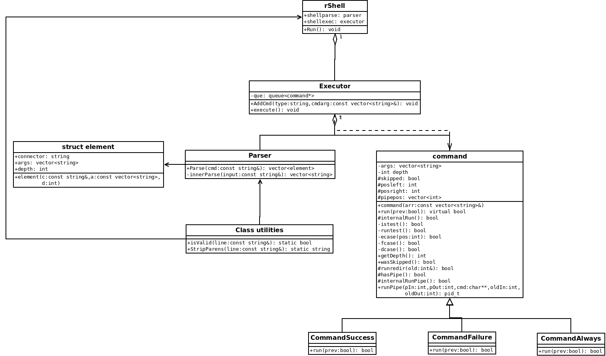

# CS 100 Programming Project

Summer A1 2019

Contributors: Kirsten Louks [SID: 861208326], Laila Aaser [SID: 862017896 ], Lindsey Young [SID: 862009924]

## Introduction
RShell is a program that will run a basic command shell in C++. Essentially, it will allow for a user to input (type) in different commands to carry out certain operations. RShell will be able to print a command prompt ($), read in commands, connect commands, and execute commands. The design team will be creating an abstract starting class called RShell. There will also be Executor and Parser classes. The Parser class simply will work like any other parser and split the user input into smaller pieces. The Executor class will be using the waitpid(), execvp() and fork() functions accordingly to carry out their operations.  The base class of CommandBase will determine what commands are carried out according to the design specifications.  There will also be an exit() function that is solely used the exit the program.  There will be a "test" and "()" functionality included as well.

## OMT Diagram
The Omt diagram should be created to show the relationships between the classes and include the functions described below in the classes section of this document.  The image for which can be found in the OMTDiagram file in the master branch and is seen below:

## Classes Description
### Class one: rShell
* This is the starting class that is first entered through the main or the terminal
* It contains a loop asking the user for input that is exited using “exit”
* It acts as the pseudo user interface
* This class prints a command prompt as requested
* This class also reads in the standard input given by the user and passes it to the parser class described below
### Class two: Parser
* This class simply breaks down the command lines given by the rShell class into small pieces then passes them to the executor
* Each piece has a type, arguments and a depth 
* The central function here, parse, takes a string and returns a vector of element
* Contains a structure called element that assists in the functionality of the code
#### Struct Element
* Has a connector string for what the break-down section is
* Has arguments
* Has an int for the depth of the ()
* Has a constructor that takes a vector of strings and the int depth
### Class three: Executor
* This class, in short, pushes the command line strings into a queue to be run in order given to the executor and uses the Command base class, described below, to actually execute the commands
* It has an execute function that will run everything given to it with a bool return type and uses the command class to tell it what to actually execute 
* The execute function specifically uses the queue listed below 
* The executor will know the special symbols (&&, ;, ||) to pass to the parser which will allow it to break down the commands
* Includes a queue (This is simply the standard library queue class that is used by the executor class to store the commands in order)
* The queue will be used, but not created in the design as it is from the std library
* Now uses the element struct to take, store, or execute arguments
### Class four: command
* This class is a base class that determines what commands should actually be executed based off of three parameters: &&, ;, ||
* These make up the three children classes: commandAnd, commandOr and commandSemiColon
* The commandSemiColon class tells takes in a previous bool of whether the last command executed and runs the next command no matter what
* The commandAnd class also takes in the previous bool but it only runs if the previous bool is true, otherwise it returns false and moves to the next command
* The commandOr class does the exact opposite of the commandAnd class and only runs the next command is the previous one returned false, otherwise returning false itself
* All three of these classes inherit from the commandBase class which has a virtual run functions as the three children classes each implement their own function
* The base class also stores the strings to be used but doesn’t alter them in any way
* It also has protected functions to check the result and execute, that the children classes can access
* The protected function (internalRun) will use the fork, execvp and waitpid to complete the commands given to this class
* Includes functions to handle piping and redirection functionality 
### Class five: Util
* This is a class made for the functions that are needed for the test and (), as well as future addaptions, that can be referenced to easily have test cases
* It has an isVald function to see if the number of () is acceptable
* It also has a function to remove the () so the code that runs the commands can ignore the () and run properly

## Prototypes and Research
Prototyping the code has proven to be quite useful, especially because it helps us determine how we would structure our code. While the prototype is a rudimentary software product, it is a representation of the final product. To create our prototype, we first had to research certain requirements of the assignment. Namely the execvp, fork and waitpid functions. 
* The execvp() function works as parameters: the first parameter is a char pointer that points to a null-terminated string that represents the name of the executable to execute. The second parameter is an array of char pointers (the first element in this array has to be the name of the executable, the remaining elements represent the list of arguments), this array must terminate with a NULL pointer. The execvp() returns -1 if execution fails.

* The fork() system call serves to create a new process. The new processes become child processes of the caller, the parent process. After a child process is created,  both parent and child will execute the next instruction following the fork() system call. fork() returns the ID of child (positive number) to the parent process, and it returns 0 to the child process. If fork() returns a negative number then forking the child process has failed.

*  After a fork() system call, this function serves to avoid making child processes "zombies". Waitpid() is used to suspend execution of the calling process. Execution of the calling process is suspended until its child process finishes execution. A parent process should use waitpid() to wait for its child process to finish execution.

## Development and Testing Roadmap
The team's development strategy will eventually become more detailed and methodical- especially, as the team further understand what is required in our program. For the moment, the team will be following a top-down analysis and early prototyping. Therefore, the team will look at the various aspects of the program and code accordingly. The team will also be using the open/closed principle (OCP),  which proposes that classes should be open for  extension, but closed for modification. This strategy uses composition instead of inheritance. The team has agreed to follow certain protocols to ensure that work is done without any major complications, these include: that development will be carried out with continued communication and collaboration, branches will be used to separate the work properly and mimimize collisions and the code will be tested as it is created in steps to avoid having errors pile up. The team members will utilize time effectively through meeting up and actively designing and implementing the code. This ensures that work will be accomplished with any and all issues being addressed immediately. The team will plan out and agree upon our objective and approach towards utilizing fork, waitpid, and execvp mentioned in the class descriptions.  The team will remain in contact throughout the course of program implementation to keep track of progress.  The team will also implement test cases together and review each other’s work, and then integrate divided work by merging branches on Github once everything has been agreed upon.  With this in mind the taks will be compleated as such, with testing assumed to be done throughout:

Lists of task to complete:
* Create CommandBase and other classes: Kirsten
(https://github.com/cs100/assignment-a1_llk/issues/2)
* Create various integration tests (assn3): Laila
(https://github.com/cs100/assignment-a1_llk/issues/7)
* Create various integration tests (assn4): Lindsey
(https://github.com/cs100/assignment-a1_llk/issues/8)
* Add the Test functionality with [] use: Kirsten
(https://github.com/cs100/assignment-a1_llk/issues/21)
* Add the () functionality: Kirsten
(https://github.com/cs100/assignment-a1_llk/issues/22)
* Add the redirection functionality: Kirsten
(https://github.com/cs100/assignment-a1_llk/issues/32)
* Add the | functionality: Laila and Lindsey
(https://github.com/cs100/assignment-a1_llk/issues/33)

